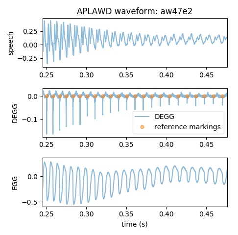

# APLAWD Reference Markings

This markings database provides 10945 text files containing
the sample indices of glottal closure instants (GCIs).

It was constructed as part of the Ph.D. research found in
"Hilbert Phase Methods for Glottal Activity Detection" by
Serwy 2017. A copy can be found at:
    http://hdl.handle.net/2142/97304

The database containing the speech and electroglottographic
signals can be acquired at:
    http://www.commsp.ee.ic.ac.uk/~sap/resources/aplawdw/
    
The direct link can be found at:
    https://www.commsp.ee.ic.ac.uk/~sap/uploads/data/aplawdw.zip

# Licenses

## APLAWD markings 
The markings database is licensed under the Creative Commons
Attribution-ShareAlike 4.0 International (CC BY-SA 4.0).
See https://creativecommons.org/licenses/by-sa/4.0/

## Code
The code is licensed under the GNU GPL version 3.0.
See https://www.gnu.org/licenses/gpl-3.0.en.html

